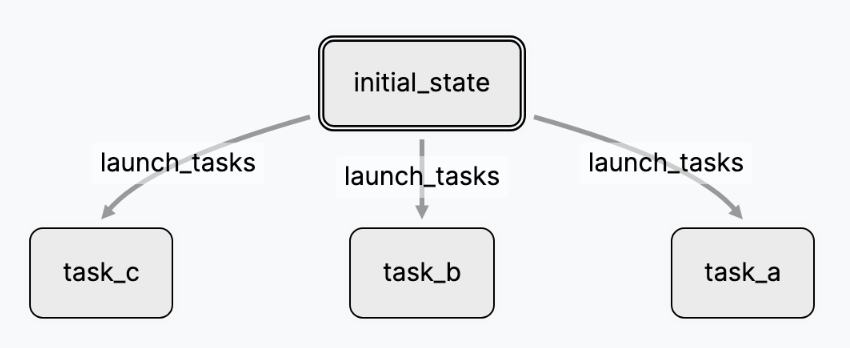
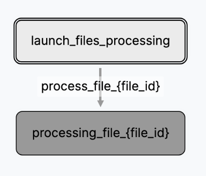
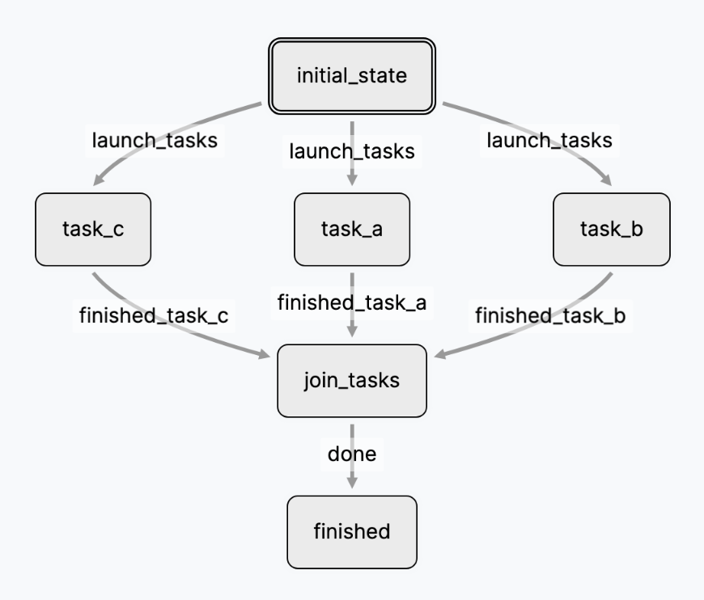
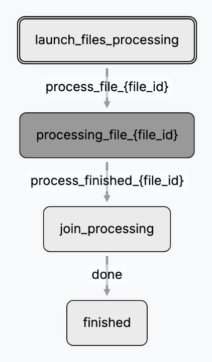

# Concurrency

Flou's Network of Agents were designed from the ground up to support
concurrency enabling easy representation of complex workflows out-of-the-box
with minimum latency.

We have two types of concurrency. When a workflow forks into two or more
distinct flows or when a workflow needs to be repeated several times
concurrently.

## Forking a workflow into different flows

When you need to execute many different tasks at the same time you just need to
define a transition that has one outgoing LTM for each task.

<figure markdown="span">
    { width=400 }
    <figcaption>Forking workflow example</figcaption>
</figure>

You just need to replace the `to` parameter with an iterable of LTMs. In this
case when `launch_tasks` is called `TaskA`, `TaskB` and `TaskC` statuses will be
changed to `queued` and the Flou Engine will execute them concurrently.

``` python title="Launching tasks concurrently example" hl_lines="9"
class ConcurrentMachine(LTM):
    name = 'concurrent_machine'

    init = [InitialState]
    transitions = [
        {
            'label': 'launch_tasks',
            'from': InitialState,
            'to': [TaskA, TaskB, TaskC]
        }
    ]
```

## Running an LTM several times concurrently

In some workflows or LLM patterns you need to run the same task several times
with different parameters. For example, you need an LLM to process several
uploaded files concurrently or you need to execute the same LLM prompt several
times and choose the most common one (self-consistency) to achieve better
performance.

Flou makes this easy with _parameterized transitions_. Just like regular Python
`f-strings` you can label your transitions and LTM names with named parameters
and then launch a transition with a set of parameters. Each parameter name has
to be surrounded by `{name}` curly brackets.

<figure markdown="span">
    { width=200 }
    <figcaption>Parameterized transition example</figcaption>
</figure>

```python title="Launching parameterized transitions example" hl_lines="5-8 12 16 26"
class LaunchFilesProcessing(LTM):
    name = "launch_files_processing"

    def run(self, payload=None):
        self.transition(
            "process_file_{file_id}",
            params=[{"file_id": "1111"}, {"file_id": "2222"}],
        )


class ProcessingFile(LTM):
    name = "processing_file_{file_id}"

    def run(self, payload=None):
        # processing code here
        file_id = self.params['file_id']
        ...


class ConcurrentProcessing(LTM):
    name = "concurrent_processing"

    init = [LaunchFilesProcessing]
    transitions = [
        {
            "from": LaunchFilesProcessing,
            "label": "process_file_{file_id}",
            "to": ProcessingFile
        }
    ]
```

In this example when transitioning `process_file_{file_id}` with parameters
`{"file_id": "1111"}, {"file_id": "2222"}]` two `ProcessingFile` will be
launched with names: `processing_file_1111` and `processing_file_2222`.

!!! warning "LTMs launched with parameterized transitions must have the same parameters in their names"
    In this case `file_id` is the parameter name and it's present in the LTM
    name `processing_file_{file_id}` and the transition
    `process_file_{file_id}`.

* You can have as many parameters as needed in a parameterized transition.
* Use `self.params` to get the params of the current executing LTM.
* You can concurrently launch either States or sub State Machines.
* Each parameterized LTM has it's own local store accessible via `self.state`.

## Joining concurrent flows

If we want to join concurrent states after a fork we need a special State that
handles the join. But first we need to understand how Flou handles updating the
store.

### Concurrently Updating the Store

When using concurrency you need to be very careful about updates to the store.
Internally `update_state` updates the local memory store immediately but waits
until the State execution finishes to update the database store atomically with
just one call. This makes it difficult to work with concurrent stores when you
have several LTMs updating it at the same time.

For this use case you can use `LTM.atomic_state_append(key, value)` that
atomically and immediately appends `value` to a pre initialized list `key` in
`self.state` and returns the updated list. This can be used when joining
concurrent forks.

### Joining forked workflows

<figure markdown="span">
    { width=400 }
    <figcaption>Concurrency fork/join example</figcaption>
</figure>

In this case we want `JoinTasks` to transition `done` only when `TaskA`, `TaskB`
and `TaskC` have executed correctly.

```python hl_lines="7-9 13-14"
class ConcurrentJoinMachine(LTM):
    name = 'concurrent_join_machine'

    init = [InitialState]
    transitions = [
        {'label': 'launch_tasks', 'from': InitialState, 'to': [TaskA, TaskB, TaskC]},
        {'label': 'finished_task_a', 'from': TaskA, 'to': JoinTasks},
        {'label': 'finished_task_b', 'from': TaskB, 'to': JoinTasks},
        {'label': 'finished_task_c', 'from': TaskC, 'to': JoinTasks},
        { 'label': 'done', 'from': JoinTasks, 'to': Finished},
    ]

    def get_initial_state(self):
        return {'executed_tasks': []}
```

We now have 3 `finished_tasks` transitions from the 3 tasks to `JoinTasks`. We
are initializing the store with an empty list `executed_tasks` that will store
the tasks that have been already executed.

We can use the transitions `payload` parameter to indicate which task has been
executed and is transitioning.


```python hl_lines="8"
class TaskA(LTM):
    name = 'task_a'

    def run(self, payload=None):
        # run task A code
        ...

        self.transition('finished_task_a', payload='A')
```

Because `JoinTasks` will be called 3 times and possible at the same time we need
to use `atomic_state_append` that will add an item to `executed_tasks` and
return the new value atomically. This way we can guarantee that in only 1 of the
3 executions `executed_tasks` will have three items, hence only transitioning
`done` once.

Note that we get which task is calling `JoinTasks` by looking at the transaction
payload.

```python hl_lines="5-7"
class JoinTasks(LTM):
    name = 'join_tasks'

    def run(self):
        executed_tasks = self.parent.atomic_state_append('executed_tasks', payload)
        if set(executed_tasks) == set(('A', 'B', 'C')):
            self.transition('done')
```

### Joining parameterized LTMs

For parameterized transitions we need to create a similar `Join` State but in
this case we might not know which or how many parameters where transitioned. We
need to save the launched `params` in the parent's store so we can retrieve them
in the `Join`.

<figure markdown="span">
    { width=200 }
    <figcaption>Concurrency parameters join example</figcaption>
</figure>

```python hl_lines="7 23"
class LaunchFilesProcessing(LTM):
    name = "launch_files_processing"

    def run(self, payload):
        uploaded_file_ids = payload['uploaded_file_ids']

        self.parent.update_state('launched_params', uploaded_file_ids)

        self.transition(
            "start_{file_id}",
            params=[
                {"file_id": file_id}
                for file_id in uploaded_file_ids
            ],
        )


class JoinProcessing(LTM):
    name = 'join_processing'

    def run(self):
        processed_files = self.parent.atomic_state_append('processed_files', payload)
        if set(processed_files) == set(self.parent.state['launched_params']):
            self.transition('done')
```
