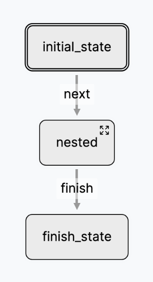
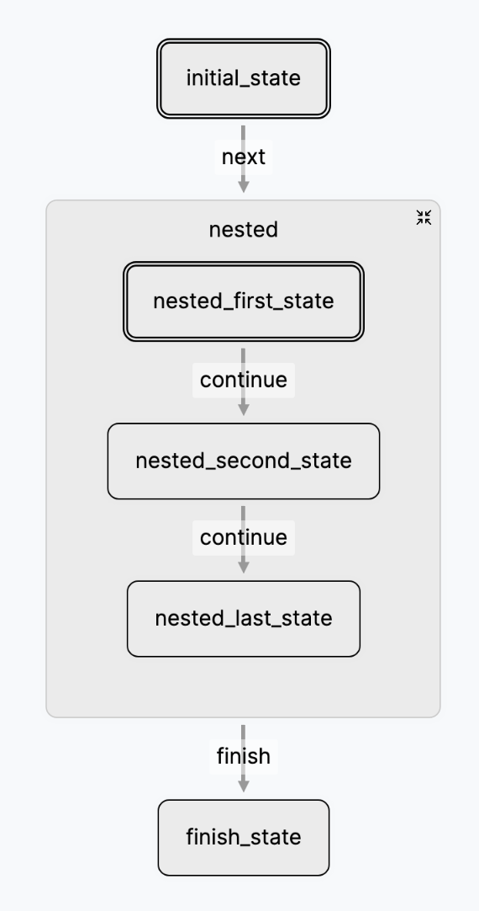
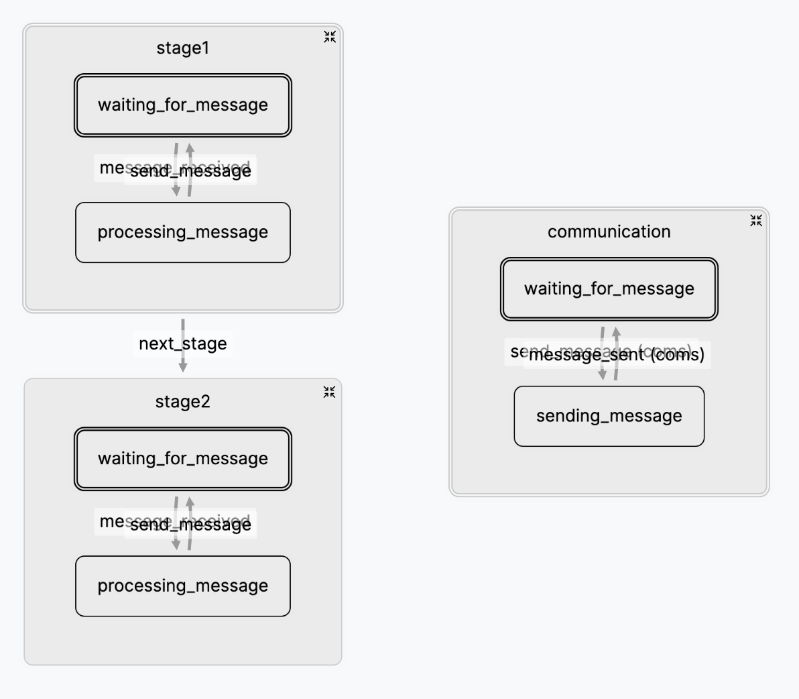
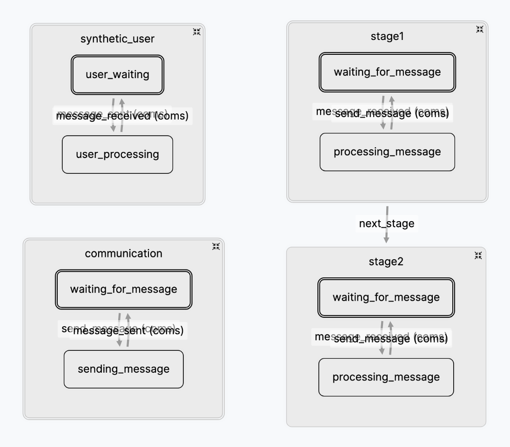

# Nesting

Flou's Network of Agents allows you to nest State Machines:

* keeping the code clean via encapsulating and decoupling
* creating reusable LLM patterns
* transforming a single prompt to it's own Network of Agents without changing
the parent LTM
* allowing comparing network experiments while keeping the same State Machine
interface

As both States and State Machines share the same base class, you can create a
nested Agents of Network simply by changing a State into it's own State Machine.

<figure markdown="span" class="side-by-side">
    { width=125 }
    { width=250 }
    <figcaption>A sample nested LTM</figcaption>
</figure>

``` python title="A sample nested LTM"
class Nested(LTM):
    name = 'nested'
    init = [NestedFirstState]
    transitions = [
        {
            'label': 'continue',
            'from': NestedFirstState,
            'to': NestedSecondState,
        },
        {
            'label': 'continue',
            'from': NestedSecondState,
            'to': NestedLastState,
        },
    ]

class Root(LTM):
    name = 'root'
    init = [InitialState]
    transitions = [
        {
            'label': 'next',
            'from': InitialState,
            'to': Nested,
        },
        {
            'label': 'finish',
            'from': Nested,
            'to': FinishState,
        },

    ]
```

Here you can see that `Root` executes `Nested` once `next` is transitioned.
Transitioning to a nested LTM simply calls `start` on the inner LTM.

As your Network of Agents becomes more complex and deeply nested collapsing and
expanding LTMs in the visual representation in the Studio becomes a crucial
tool.

## Accessing ancestors State Machines

When inside a child LTM State you may need to access ancestors machines. Flou
gives you two ways of doing this:

* `self.parent` which returns the parent State Machine. This is relative to the
current State. You can call `self.parent.parent` recursively but it's not
recommended to nest your logic to several nesting layers. Try to keep your logic
relevant to the current and parent machine.
* `self.root` which returns the root State Machine (in the case of multiple
levels of nesting). This allows the root State Machine to act as a [global
store](#using-nested-stores).

### Using nested stores

You can access the `root` or `parent` stores to share information between State
Machines.

* `self.parent.state` & `self.parent.update_state(...)`
* `self.root.state` & `self.root.update_state(...)`

## Transition Namespaces

Flou creates transition namespaces for each State Machine, so the transitions
are performed at just one LTM level and don't clash with one another. These
namespaces are named by the Fully Qualified Name (FQN) of the LTM by joining the
hierarchy LTM names with '.' (dots).

In the above case we have 2 namespaces: `root` and `root.nested`. If we want
`NestedLastState` to transition `finish` in `Root` we need to do it in the
`root` namespace. We have 3 ways of achieving this:

* by absolutely calling `transition` in the root machine:

    ``` python
    self.root.transition(...)
    ```

* by relatively using the parent:

    ``` python
    self.parent.transition(...)
    ```

* by explicitly passing the namespace as a parameter:

    ``` python
    self.transition(..., namespace='root')
    ```

!!! note "Note that in this example all three are equivalent but this is not always the case"

```python title="Transitioning parent State Machine"
class NestedLastState(LTM):
    name = 'nested_last_state'

    def run(self, payload=None):
        # your code here
        ...

        # all three options are equivalent in this case
        self.parent.transition('finish')
        self.root.transition('finish')
        self.transition('finish', namespace='root')
```

### Custom namespaces

If you want to communicate arbitrary State Machines, you can do it by creating
custom namespaces.

``` python
{
    'label': 'transition_label',
    'from': OneState,
    'to': AnotherState,
    'namespace': 'custom',
}
```

This transition does not exist in the containing State Machine but in the
`custom` namespace. The only way of performing this transition is by explicitly
passing the namespace parameter:

```python
self.transition('transition_label', namespace='custom')
```

This way you can perform transitions at a distance.

## Use cases

### Decoupling client-server communication

A common practice is to encapsulate all the communication to the client in a
separate LTM improving decoupling. Let's imagine que have a complex workflow
with several stages in nested LTMs that can all talk with the client.

<figure markdown="span">
    { width=600 }
    <figcaption>Decoupling communication example</figcaption>
</figure>

```python title="Decoupling communication example" hl_lines="10 16"
class Communication(LTM):
    name = 'communication'

    init = [WaitingForMessage]
    transitions = [
        {
            'from': WaitingForMessage,
            'to': SendingMessage,
            'label': 'send_message',
            'namespace': 'coms',
        },
        {
            'from': SendingMessage,
            'to': WaitingForMessage,
            'label': 'message_sent',
            'namespace': 'coms'
        },
    ]


class MyChatbot(LTM):
    name = 'my_chatbot'

    init = [Stage1, Communication]
    transitions = [
        {
            'label': 'next_stage',
            'from': Stage1,
            'to': Stage2
        },
    ]
```

In this example, any State inside `Stage1` or `Stage2` can call
`self.transition('send_message', namespace='coms')` to send a message to the
client.

### E2E testing (simulating an user)

If your workflow has many interactions with the user testing it E2E can be
difficult. With Flou it's as easy as adding a new State Machine that simulates a
synthetic user.

Let's continuing with the previous example and add Synthetic User. By adding a
new Synthetic User State Machine that listens to `message_sent` and
`message_received` but in reverse we can simulate a user.

<figure markdown="span">
    { width=600 }
    <figcaption>Synthetic user example</figcaption>
</figure>

``` python
class SyntheticUser(LTM):
    name = 'synthetic_user'

    transitions = [
        {
            'label': 'message_sent',
            'from': UserWaitingForMessage,
            'to': UserProcessingMessage,
            'namespace': 'coms',
        },
        {
            'label': 'message_received',
            'from': UserProcessingMessage,
            'to': UserWaitingForMessage,
            'namespace': 'coms',
        },
    ]
```

`UserProcessingMessage` can be Network of Agents as complex as you need it to be
to successfully create all the needed messages for the E2E test.
