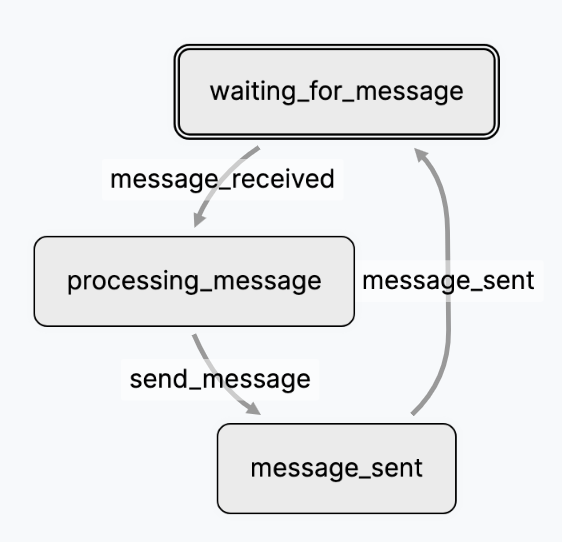

# States and Machines

The Agents Networks are State Machines. Its implementation is a Labelled
Transition System called Labelled Transition Models (LTM). This design allows
developers to experiment on the structure and transitions while tracking each
change and provides several features out-of-the-box like: [store
management](#store-management), [nesting](./nesting.md),
[concurrency](./nesting.md) and an execution time machine.

Creating your application using Networks of agents helps you decouple your
LLM/AI related code from the rest of your application.

The LTMs are composed of States (units of code) that are orchestrated by a State
Machine via transitions.

## States

A State is a single computation unit. It can be any code, i.e. prompting an LLM,
accessing third party APIs, manipulating data and launching transitions. The
code runs when the state gets executed.

Every State derives from the `LTM` base class and has a mandatory `name` and the
corresponding code.

```python title="A sample State"
from flou.ltm import LTM

class ProcessingMessage(LTM):
    name = 'processing_message'

    def run(self, payload=None):
        message = payload['message']
        # process message here
        ...
```

* `name` can be any lowercase string that starts with a letter and can contain
numbers and underscores: `^[a-z][a-z0-9_]*$`. Each name must be unique.
* `run` receives an optional [payload](#attaching-data-to-a-transition-payload)
and can contain any code. To use third party packages you need to install them
in the project's [dependencies](../engine/dependencies.md).

    !!! warning "Never call `run` manually"
        `run` should never be called manually, the State Machine handles every
        execution.

Just one State is enough to use Flou, this is the most simple case from which
you can build upon.

### Noop State

A special case of States are the no-operation (Noop) States that don't have any
code associated with them. They are used to represent an idle state waiting for
a transition.

```python
class IdeState(LTM):
    name = 'idle_state'
```

## State Machines

The Flou State Machines capture the structure of the Agents Network defining
it's States transitions. As with the States, they inherit from LTM and must have
an unique name.

Let's create a sample Agents Network/State Machine for a simple chatbot.

<figure markdown="span">
    { width=250 }
  <figcaption>A sample chatbot Agents Network</figcaption>
</figure>

```python title="A sample chatbot State Machine"
from flou.ltm import LTM
from flou.registry import registry

class MyChatbot(LTM):
    name = 'my_chatbot'

    init = [WaitingForMessage]
    transitions = [
        {
            'label': 'message_received',
            'from': WaitingForMessage,
            'to': ProcessingMessage
        },
        {
            'label': 'send_message',
            'from': ProcessingMessage,
            'to': SendingMessage
        },
        {
            'label': 'message_sent',
            'from': SendingMessage,
            'to': WaitingForMessage
        },
    ]

registry.register(MyChatbot)
```

* As with a State each State Machine needs an unique name.
* `init` is a list of States classes that will get executed when the State
Machine starts.
* `transitions` is a list of dictionaries indicating each transition with a
`label`, a `from` State and a `to` State.
* `registry.register` adds this State Machine to Flou.

In this chatbot example we have three States:

* `WaitingForMessage` is an initial State, when the State Machine starts it will
execute this state. In this case `WaitingForMessage` can be an [idle
State](#noop-state).
* `ProcessingMessage` receives the user's message and processes it to generate a
response. Here's where you would call your LLM.
* `SendingMessage` encapsulates all the logic needed to send the message to the
client UX. Keeping this State separate from processing the message decouples the
LLM-related and communication-related code maintaining separation of concerns maintaining separation of concerns.

### Starting a State Machine

To start a State Machine it's as easy as creating an instance and running
`start`.  Notice it should be run only once.

```python
chatbot = MyChatbot()
id = chatbot.start()
```

The resulting `id` is unique and can later be used in the API to reference the
created instance.

### State statuses

When running a State Machine each State get's a status. The possible status are:

* `init`: the state has been initialized but is not yet queued for execution.
* `queued`: the state is pending execution by the Flou engine.
* `active`: the state has been executed and can now transition.
* `completed`: the state has been executed and an outgoing transition has been
performed.

### Transitioning

Each transition has a `from` and `to` parameters. When a transition is performed
the State Machine looks for every possible transitions of States that are in the
`active` status. This means the State can transition onto a new State, changing
the `from` State status to `completed` and the `to` State status to `queued`.

!!! warning
    Performing a transition with no outgoing States in an `active` status
    results in an error.

Calling a transition:

``` python title="Performing a transition"
chatbot.transition('message_received', payload={'message': message})
```

The `transition` signature is:

``` python
LTM.transition(label, payload=None, params=None, namespace=None)
```

!!! info "For more information on `params` and `namespace` check [Nesting](../network/nesting.md) and [Concurrency](../network/concurrency.md)."

!!! info "The transitions are performed after the State has finishes executing"
    The order in which you execute code in `run` and call `self.transition` does
    not matter. The transitions are gather and only performed once the State has
    successfully executed.

## Attaching data to a Transition (Payload)

When a transition should have data attached to it you can send them via the
`payload` parameter. In the case of our chatbot `message_received` and
`message_sent` can use this feature:

``` python
chatbot.transition(`message_received`, payload={'message': "A message"})
```

!!! info "The payload can be any serializable python data structure."

Payloads are great for data that is strictly related to a single transition
since they aren't stored in a permanent fashion.

## Store Management

Flou provides a **data store** out-of-the-box. Each State Machine has a store
that any State can access and each State has it's own local store.

``` python title="Sample Store code"
class MyState(LTM):
    name = 'my_state'

    def get_initial_state(self):
        return {
            "key1": "example",
            "key2": "other",
        }

    def run(self, payload=None):
        self.state  # local State store
        # returns {
        #     "key1": "example",
        #     "key2": "other",
        # }

        self.root.state
        # returns the State Machine global store
```

!!! warning "`state` will be renamed `store` in upcoming releases"

Every `LTM` has a function `get_initial_state` that is used during the State
initialization to create it's local store. It must return a dictionary. Keys
cannot start with `_` (underscore) as they are reserved for Flou internal
properties.

Using `self.state` you can retrieve the store of the current State.

Using `self.root.state` you can access the global store of the State Machine.

### Modifying the store

!!! warning "Don't attempt to directly modify `.state`, use `.update_state()` instead"
    As Flou is prepared for concurrency in order to update the store you need to
    use the special function `update_state`.

To update the store use the special function `update_state` which expects a
dictionary. This creates or overwrites the desired keys.

To update a nested key in the store you need to use the Qualified Name of the
path to access that key separated by `.` (dots). For example:

``` python
def run(self, payload=None):
    self.state
    # returns {}

    self.state['key'] = {'a': 1, 'b': 1}
    # **INVALID**, use `update_state`

    self.update_state({'key': {'a': 1, 'b': 2}})
    # updates the state

    self.state
    # returns {'key': {'a': 1, 'b': 1}}

    self.update_state({'key': {'a': 3})
    # replaces `key` with `{'a': 1}`

    # use instead
    self.update_state({'key.a': {'a': 3})  # replaces ['key']['a'] with {'a': 1}
```

!!! abstract "Changes to the store are not immediately committed to the database"
    When calling `update_state` the in memory store get's updated but the
    database isn't updated until the State code is executed successfully. This
    keeps the State execution in an atomic transaction.
