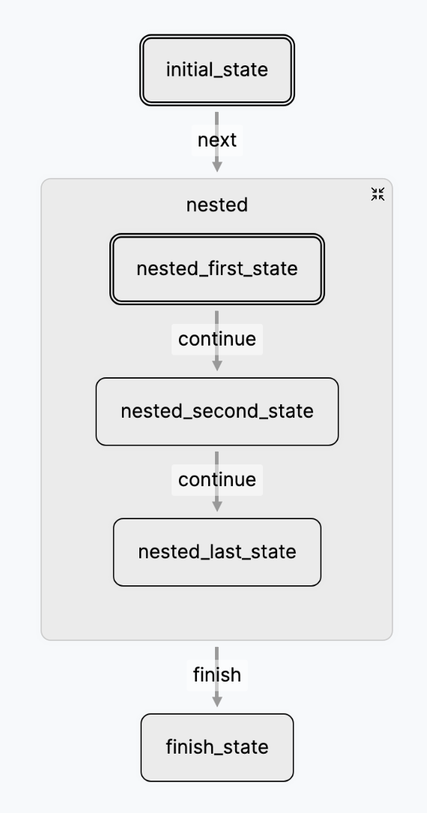

# Studio

The Flou Studio is an integral part of the framework. It let's you work with
your Networks of Agents interactively and visually greatly improving the
developer UX.

You can access the Studio visiting <http://localhost:8001/>.

## Visual representation

With the Studio's visual representation you can navigate your LTMs viewing the
whole structure at a glance making it much easier to form a mental model of
complex Networks of Agents. By clicking in a State you can see additional
properties in a tooltip.

Each State status has an unique color and you can see the current
transition/execution by an animated dashed line.

You can collapse and expand nested LTMs by clicking in the collapse/expand icon.
Double clicking on a sub LTM zooms into that particular sub LTM isolating it and
letting you work on just parts of the network.

<figure markdown="span" class="side-by-side">
    { width=125 }
    { width=250 }
    <figcaption>Collapsing and Expanding LTMs</figcaption>
</figure>

When working with parameterized LTMs and concurrency you can click on a
parameterized State to see every spawned instance and zoom into one.

<figure markdown="span">
    { width=250 }
    <figcaption>Parameterized instances</figcaption>
</figure>

## Inspect

The Inspect section of the Studio can be used for observability and inspection
of production traces of your LTMs. You can list every executed LTM and see the
details of a particular one.

The inspector updates in real-time as your LTM executes.

### Execution history (snapshots)

<figure markdown="span">
    { width=450 }
    <figcaption>Snapshots table</figcaption>
</figure>

The Flou Engine saves a snapshot of you LTMs at every State execution and
performed transition. In the Studio you can navigate the execution history at
any point in time.

You can see an ordered list of every snapshots to trace and inspect the
execution and see the State statuses and store values and how they evolved.

### Store inspection

<figure markdown="span">
    { width=250 }
    <figcaption>Store</figcaption>
</figure>

At any point in time you can inspect a snapshot of the internal store of the LTM
(and any sub State) or see what particular changes (diff) were made to the store
in that snapshot.

## Playground

In the Studio's playground you can not only inspect an LTM but interact with it,
modifying it's state. You can either create an LTM instance from scratch
(Playgroud > + New LTM) or inspect a production LTM and "Copy and Open LTM in
Playground" to interact with it.

### Transition

<figure markdown="span">
    { width=350 }
    <figcaption>Transition form</figcaption>
</figure>

You can manually perform a transition by filling the `label`, `namespace` and
optional `params` and `payload` in the **transition form**. The transition and
executions will be updated in real-time.

### Rollback & Replay

When developing a Network of Agents it's common practice to retry certain steps,
i.e. calls to LLM models. Flou is equipped with rollbacks to go back to any
point in time and continue the execution from that point onwards. It also let's
you replay a certain transition so you don't need to manually input that
transition again.

<figure markdown="span">
    { width=550 }
    <figcaption>Rollback & Replay buttons</figcaption>
</figure>

Flou is designed so it never looses any information; when performing a rollback
it gets saved and you can "undo" any rollback you have performed keeping the
whole execution history.

<figure markdown="span">
    { width=550 }
    <figcaption>Rollbacks history</figcaption>
</figure>
