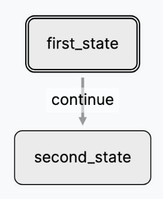

# Creating a sample Agents Network

An Agents Network is the brain of your LLM app. It's a network of LLM model
prompts, tools and arbitrary procedures structured in a state machine. Achieving
great performance on your Agents Network is an iterative process.

Let's create a sample Newtork to get you started.

<figure markdown="span">
    { width=150 }
  <figcaption>A simple Agents Network</figcaption>
</figure>

Copy the following code into your `app.py`:

``` py title="app.py"
from flou.ltm import LTM
from flou.registry import registry


class FirstState(LTM):
    name = 'first_state'

    def run(self, payload=None):
        self.transition('continue')


class SecondState(LTM):
    name = 'second_state'


class MyNetwork(LTM):
    name = 'root'
    init = [FirstState]
    transitions = [{'from': FirstState, 'label': 'continue', 'to': SecondState}]


registry.register(MyNetwork)
```

Let's break this down.

## Defining basic States

A State is the atomic unit of Flou. It get's executed by the Flou Engine when
transitioned to. It contains the prompts to LLMs, executing arbitrary code, etc.

``` py title="A simple State"
class FirstState(LTM):
    name = 'first_state'

    def run(self, payload=None):
        self.transition('continue')
```

* `LTM` is the base class from where all states and machines inherit. You always
  need to define a `name` property.
* The `run` method contains the code that runs when the state executes.
* `self.transition(label)` indicates the Flou engine to transition every
  _active_ state that has an outgoing `label` transition.

``` py title="A final State"
class SecondState(LTM):
    name = 'second_state'
```

* This state is a `noop` (no operation) State. It doesn't run any code.

## Defining a State Machine

A Network is the orchestration layer of States. It establishes the transitions
between the states and specifies the initial States.

``` py title="The State Machine"
class MyNetwork(LTM):
    name = 'root'
    init = [FirstState]
    transitions = [{'from': FirstState, 'label': 'continue', 'to': SecondState}]
```

* `MyNetwork` is a State Machine called `root`.
* `init` specifies which are the `initial` states that need to be run when the
  Machine starts.
* `transitions` is a list of transitions that indicate the _labelled_ relations
  between the states. In this case we have just one transition from `FirstState`
  to `SecondState` labelled `continue`.

## Registering your Agents Network

``` py title="Registering the Agents Network"
registry.register(MyNetwork)
```

* By registering `MyNetwork` we make it available for the Flou Engine & Studio.
